# dataliteRS

WiFi-to-RS232 bridge for **Datalite DX-3200** LED display controllers, running on an ESP32-C3. Provides a web UI to compose and send multi-page content over the serial bus.

## Architecture

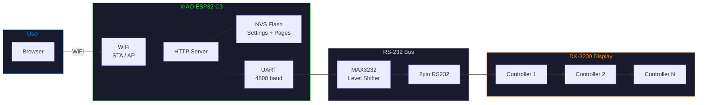

## Project Structure

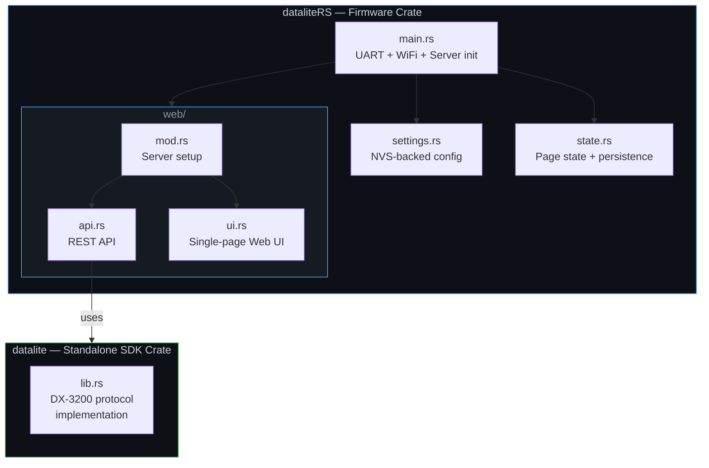

```
dataliteRS/
├── src/
│   ├── main.rs              # Entry point: UART, WiFi (STA/AP), web server
│   ├── settings.rs          # Persistent settings in NVS flash
│   ├── state.rs             # Display page state with NVS persistence
│   └── web/
│       ├── mod.rs            # HTTP server setup
│       ├── api.rs            # JSON API endpoints
│       └── ui.rs             # Embedded web UI
├── datalite/                # Standalone SDK (no ESP dependencies)
│   ├── Cargo.toml
│   └── src/lib.rs
├── build.rs                 # ESP-IDF build glue
├── sdkconfig.defaults       # ESP-IDF: stack size, WiFi AP
├── rust-toolchain.toml      # Nightly (ESP-IDF std)
└── .cargo/config.toml       # Target: riscv32imc-esp-espidf
```

### Firmware (`src/`)

- **WiFi** — connects as a client (STA) to a configured network, falls back to AP mode (`DatalitePanel` / `datalite123`).
- **UART** — drives the RS-232 bus at 4800 baud on GPIO21 (TX) / GPIO20 (RX).
- **Web server** — embedded HTTP server with a JSON API and character-grid web UI.
- **NVS persistence** — all settings and page content survive reboots.

### `datalite` SDK

The `datalite/` directory is an **independent, standalone crate** with no ESP or embedded dependencies. It implements the DX-3200 serial protocol and can be used in any Rust project that has a `std::io::Write` sink (serial port, TCP socket, file, etc.).

```rust
use datalite::Display;

// 2 controllers, 8 lines each, 48 chars per line
let display = Display::new(2, 8, 48);
let mut serial = std::fs::File::create("/dev/ttyUSB0").unwrap();

display.commit_pages(
    &mut serial,
    &[
        display.page(1)
            .line(1, "Hello world")
            .brightness(17)
            .readtime_secs(5.0),
        display.page(2)
            .line(1, "Page two")
            .readtime_secs(3.0),
    ],
).unwrap();
```

The SDK supports multi-controller addressing, multi-page content, inline blink markers, brightness, scroll/fade effects, moving speed, bold text, scheduling, and clock sync. It has its own `rust-toolchain.toml` (stable) and build target (`x86_64-unknown-linux-gnu`) so it can be developed and tested independently with `cargo test -p datalite`.

## Hardware

### Components

| Part | Role |
|------|------|
| **Seeed XIAO ESP32-C3** | Microcontroller — runs the firmware, provides WiFi and UART |
| **UART-to-RS232 converter** (e.g. MAX3232 breakout) | Level-shifts 3.3V UART to RS-232 voltage levels for the DX-3200 bus |
| **RJ45 cable** | Carries the RS-232 signal to the display controller chain |

### Wiring

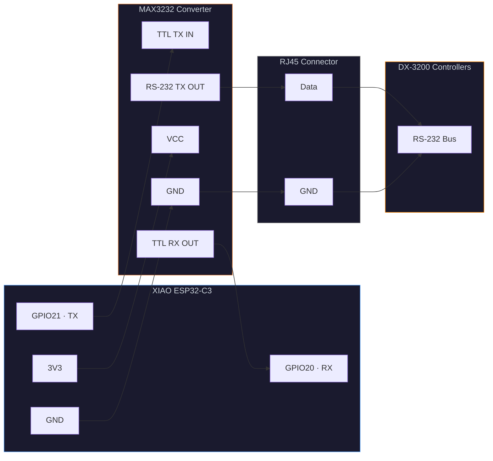

UART runs at **4800 baud**, matching the DX-3200 protocol.

### Mounting Options

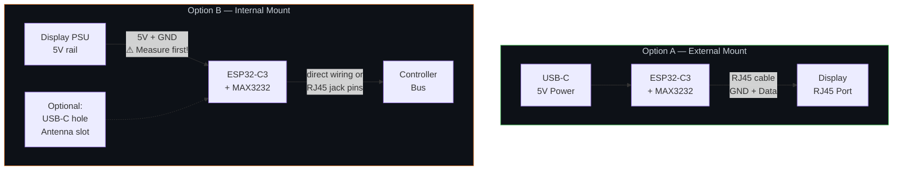

**External (outside the display housing)**

Place the ESP32-C3 and RS-232 converter in a separate enclosure. Cut an RJ45 cable from the converter into the display's RJ45 port. Only GND and Data out have to be connected to the Screen. Power the ESP32-C3 via its USB-C port from any 5V source.

**Internal (inside the display housing)**

1. Mount the ESP32-C3 and converter board inside the display enclosure.  
2. Connect the converter's RS-232 output directly to the controller bus (no RJ45 needed, or use the existing internal connector).  
You can either connect it to the first Controller or to the Ports of the RJ45 Jack. For me it was measuring GND against GND of the Controller Board and guessing Data. As only one of the other two wires was connected to the controller, it was obvious.  
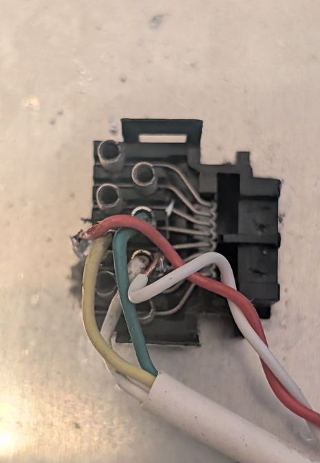  
<br />
3. Tap **5V from one of the display's internal power supply** to power the ESP32-C3 via its 5V pin (not USB-C). **Measure first to Validate 5V!**  
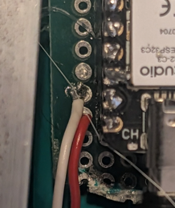
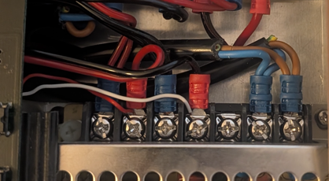  
<br />
4. *Optional:* Drill a small hole in the housing for the **USB-C port** — useful for reflashing firmware and debugging without opening the case.  
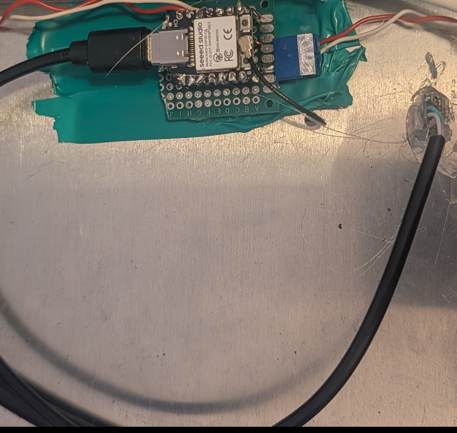
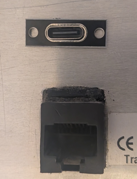  
<br />
5. *Optional:* Drill or route a slot for the **WiFi antenna** to improve signal as the housing is metal.  
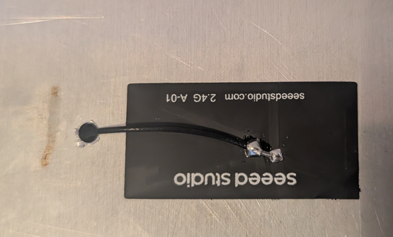
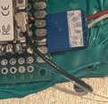  
<br />

*Now you have a clean future-proof setup which allows most importantly portability. For me that is why i choose it.*


## Building & Flashing

Prerequisites: [espup](https://github.com/esp-rs/espup), `ldproxy`, `espflash`.

```sh
cargo run --release
```

This builds the firmware and flashes it via `espflash` (configured as the runner in `.cargo/config.toml`).
